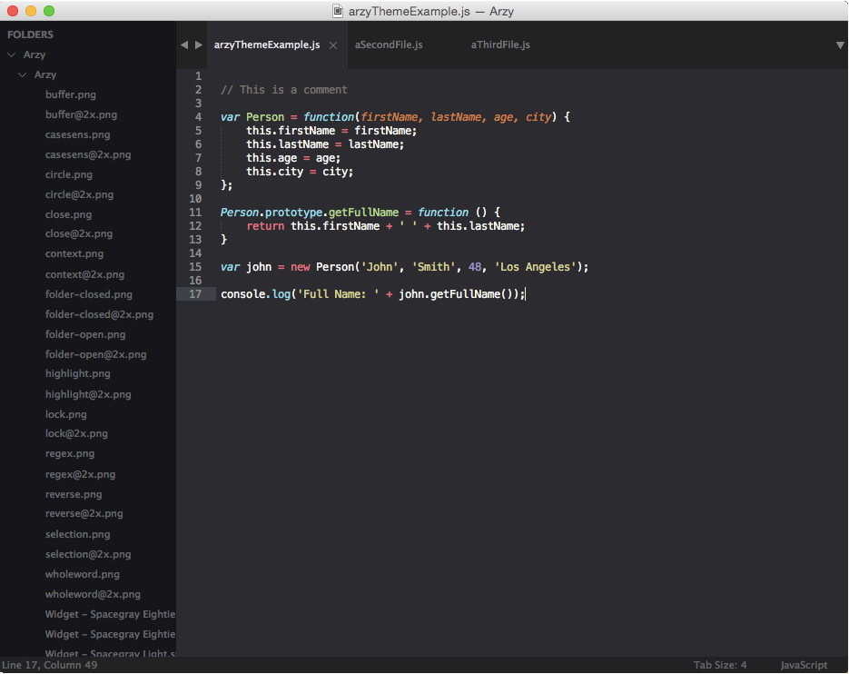
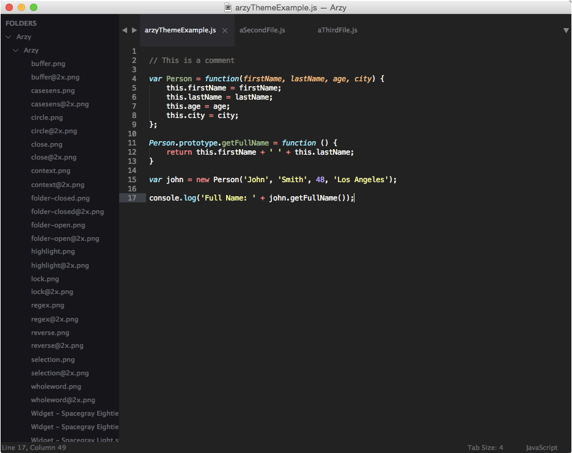

# Arzy
A minimal, yet beautiful theme for Sublime Text. Sidebar like Spacegray. Larger tabs like Predawn. Background color closer to true gray. Color schemes closer to, but not exactly like Monokai with varying contrasts.

***

### Themes

#### Olympus



#### Heliopolis



***

### How to Install

#### Via Package Control

[Sublime Package Control](https://sublime.wbond.net) is the best way to install. Find the Arzy theme by searching for `Theme - Arzy`.

1. Open Command Palette using menu item `Tools -> Command Palette...` (<kbd>⇧</kbd><kbd>⌘</kbd><kbd>P</kbd> on Mac)
2. Choose `Package Control: Install Package`
3. Find `Theme - Arzy` and press <kbd>Enter</kbd>

#### Manual

To install the Arzy theme manually:

1. [Download the .zip](https://github.com/rzCodes/arzy/archive/master.zip)
2. Unzip and rename the folder to `Theme - Arzy`
3. Copy the folder into `Packages` directory. Find that by clicking `Sublime Text -> Preferences -> Browse Packages...`

***

Activate the UI theme and color scheme by modifying your user preferences file. Find that by clicking `Sublime Text -> Preferences -> Settings - User` (<kbd>⌘</kbd><kbd>,</kbd> on Mac).

Remember to restart Sublime after switching to the Arzy theme.

#### Settings for Olympus

```json
{
  "theme": "Arzy.sublime-theme",
  "color_scheme": "Packages/Theme - Arzy/Olympus.tmTheme"
}
```

#### Settings for Heliopolis

```json
{
  "theme": "Arzy.sublime-theme",
  "color_scheme": "Packages/Theme - Arzy/Heliopolis.tmTheme"
}
```
### Settings

#### Tab labels font size

Copy and paste one of four options in your user preferences file:

```json
  "arzy_tabs_font_small": true
```
```json
  "arzy_tabs_font_normal": true
```
```json
  "arzy_tabs_font_large": true
```
```json
  "arzy_tabs_font_xlarge": true
```

#### Tabs size

Tabs height:

```json
  "arzy_tabs_small": true
```
```json
  "arzy_tabs_normal": true
```
```json
  "arzy_tabs_large": true
```
```json
  "arzy_tabs_xlarge": true
```

Tabs width: 

```json
  "arzy_tabs_auto_width": true
```

#### Sidebar labels font size

```json
  "arzy_sidebar_font_small": true
```
```json
  "arzy_sidebar_font_normal": true
```
```json
  "arzy_sidebar_font_large": true
```
```json
  "arzy_sidebar_font_xlarge": true
```

#### Sidebar tree rows height

```json
  "arzy_sidebar_tree_xsmall": true
```
```json
  "arzy_sidebar_tree_small": true
```
```json
  "arzy_sidebar_tree_normal": true
```
```json
  "arzy_sidebar_tree_large": true
```
```json
  "arzy_sidebar_tree_xlarge": true
```


